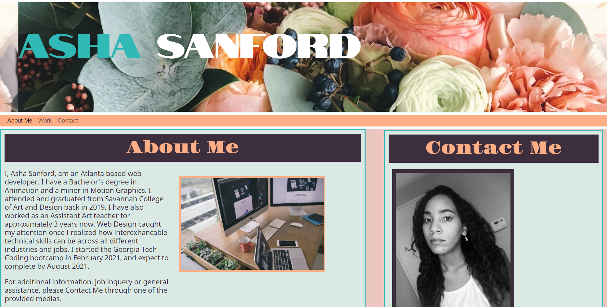

# Week 2- Portfolio Webpage

This project is a portfolio webpage for Asha Sanford. This webpage will be used to display future applications for job opportunities. 

I created an "about me" section with general information about me as a coder and web developer.

I created a "work" section on the page that has placeholder spots to showcase future projects.

I created a navagation bar under the site header to help visitors navigate through the page and quickly find the correct place.

I created a "contact me" section for visitors to reach out to Asha Sanford through phone, email, etc for additional information.

# Webpage Screenshot

# Link to Portfolio Webpage

https://ashasan1.github.io/gt-week2-portfolio/